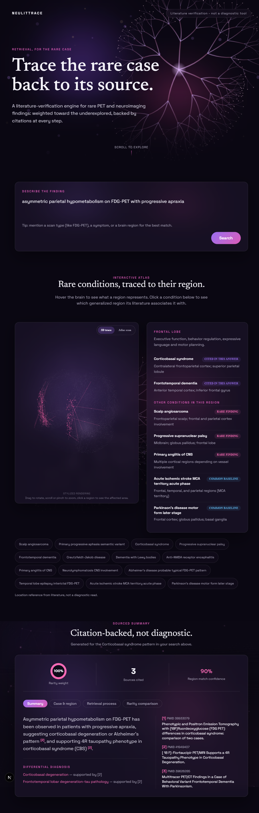

# NeuLitTrace

**A search tool for rare PET and neuroimaging findings that cites every claim it makes — and gets sharper the more a researcher uses it.**

Type in a plain-language description of an imaging finding (a brain region plus an abnormality), and NeuLitTrace searches a curated set of published case reports and papers, writes a summary that answers your question, and attaches a numbered citation to every sentence so you can check the source yourself. Identify yourself as a returning researcher and it remembers the conditions you've already explored, so later summaries build on what you know instead of repeating it.



## Table of Contents

- [What problem this solves](#what-problem-this-solves)
- [Who this is for](#who-this-is-for)
- [What it is not](#what-it-is-not)
- [How it works](#how-it-works)
- [Memory and personalization](#memory-and-personalization)
- [Cost tracking](#cost-tracking)
- [Tech stack](#tech-stack)
- [Project structure](#project-structure)
- [Setup and quickstart](#setup-and-quickstart)
- [Testing](#testing)
- [Known limitations](#known-limitations)
- [Full documentation](#full-documentation)
- [License](#license)

## What problem this solves

Search engines are good at common cases. If a symptom is well documented, a doctor or researcher can find matching literature in seconds. But rare conditions break this: there may be only a handful of published case reports on a given rare finding, and standard search or general-purpose retrieval tools have no reason to surface them over more common, better-represented conditions.

A published pilot study at Seoul National University Hospital tested nearly this exact approach (retrieval-augmented generation over PET case reports). On common cases it worked well: 84.2% of routine cases retrieved relevant matches, agreed upon by three physician readers. On rare cases it broke down. It failed to retrieve a documented case of scalp angiosarcoma specifically because the condition was rare. The authors named better rare-case retrieval as necessary future work. That is the exact gap this project targets: retrieval built to favor rare and underexplored conditions instead of penalizing them.

## Who this is for

Researchers, clinicians, and students exploring rare neuroimaging findings who want a starting point grounded in real published literature, not a general-purpose search engine or an unsourced chatbot answer. Every claim in the output traces back to a specific paper, so it is meant to be a research aid you can verify, not a final answer. Return with the same identity across sessions and the system tracks what you've already been shown and what you've explored, so it stops re-surfacing the same papers and starts building continuity on the conditions you're following.

## What it is not

NeuLitTrace is a research tool, not a clinical or diagnostic tool. It does not analyze images, and it does not tell you what a patient has. The brain-region visualization shows where the literature describes findings for a matched condition, not a diagnosis generated from your input. Every summary includes a disclaimer stating this. The corpus is fixed at 329 papers across 14 conditions (10 rare, 4 common for comparison); it is not fetched live per query, so results are limited to what is in this dataset. Personalization only ever reorders and annotates what you see — it narrows repetition, it never hides a result or invents one.

## How it works

**1. You describe a finding.** For example, "asymmetric parietal hypometabolism on FDG-PET with progressive apraxia" (mention a scan type, a symptom, and a brain region for the best match).

**2. The system searches and refines.** The query is expanded using HyDE (Hypothetical Document Embeddings), then matched against the corpus via Snowflake Cortex Search — native hybrid lexical + vector retrieval — with a boost applied toward rare conditions after retrieval. If you're identified, a memory-conditioned re-rank runs next (see below). An LLM then checks whether the results are actually relevant; if not enough of them are, the system rewrites the query and searches again, up to two rounds total.

**3. The system writes a sourced summary.** Once enough relevant papers are found, an LLM (Snowflake Cortex `COMPLETE`) reads their abstracts and writes an answer, with a `[1]`, `[2]`, etc. citation on every claim. A second, independent LLM pass checks each citation against its source abstract before the summary is shown to you, flagging anything unsupported. If you have a researcher profile, a short description of what you've already explored is folded into the prompt so the summary emphasizes what's new to you — without ever mentioning your profile back to you.

**4. You see the evidence, not just the answer.** The result includes an interactive brain-surface map highlighting the matched region, the full sourced summary, every cited paper, a step-by-step trace of the search loop (each round's confidence score and whether the relevance check passed), and — when personalization is on — how many already-seen papers were demoted and whether your profile was applied.

For the full technical breakdown (components, request flow, reliability, and security behavior), see [`docs/architecture.md`](docs/architecture.md), or the same page rendered in the VitePress docs site (see [Full documentation](#full-documentation) below).

## Memory and personalization

Retrieval and summarization are stateless by default. Pass a `user_id` and `session_id` and opt in with `personalize: true`, and an EverMind EverOS-backed memory layer starts tracking, per user:

- **A researcher profile** — a free-text specialty, the set of conditions you've been shown results for, and how many queries you've run.
- **A session thread** — the queries and papers shown within a single conversation.
- **A durable seen-paper set** — every PMID you've ever been shown, across sessions.

That memory changes two things about a later query. First, retrieval excludes papers you've already seen before re-ranking runs at all; anything that slips through anyway is demoted, not deleted. Second, papers on conditions you're already following get a continuity boost. Both effects are capped so personalization can never outrank this project's core claim — a rare paper you haven't seen always outranks a common one you have, no matter how much of that common condition you've explored.

Every several queries (or whenever your specialty changes), a short natural-language description of your profile is regenerated and injected into the summary prompt — capped at 600 characters, and guaranteed never to contain a PMID or verbatim query text. A memory outage never fails a search: if the memory backend is slow or unreachable, the query still returns in full, just without personalization, and says so honestly in the response.

You can inspect or clear this at any time via `GET /memory/profile`, `GET /memory/thread`, and `POST /memory/forget`.

## Cost tracking

Every LLM call — HyDE expansion, relevance check, query refinement, summary generation, citation verification, and profile distillation — is priced and logged to a Snowflake cost ledger with its own request ID, call site, token counts, and latency. `GET /economics/summary` and `GET /economics/request/{request_id}` expose that ledger directly; `POST /economics/ask` lets you ask cost questions in plain language, answered by Snowflake Cortex Analyst against the same data. Each `/query` response also carries its own cost breakdown by call site, so the price of a single search is visible without a separate lookup.

## Tech stack

**Backend:** Python, FastAPI, Pydantic, slowapi (rate limiting). Retrieval and inference run on Snowflake Cortex: Cortex Search Service for hybrid lexical + vector retrieval, `COMPLETE` for every LLM call, and a `TOKEN_LEDGER` table for the cost story. Memory and personalization run through EverMind EverOS. The application talks to all of it through a small ports layer (`backend/contracts`), so the entire stack — retrieval, LLM, memory, cost ledger — can also run against deterministic in-process fakes with zero credentials, which is what local development and the test suite use by default.

**Frontend:** Next.js (App Router), React, Tailwind CSS 4, shadcn/ui.

**Docs:** VitePress, with D2-generated architecture diagrams.

## Project structure

```
backend/            Python service: retrieval + search loop + summary + citation
                     verification + memory, behind backend/contracts (ports/models/
                     fakes), wired up per-environment by config/services.yaml
backend/memory/      EverMind EverOS integration, profile distillation, memory-
                     conditioned re-rank
backend/snowflake/   Cortex Search / Cortex COMPLETE / cost ledger clients
frontend/            Next.js app: query form, brain viewer, sourced summary and
                     citation UI
docs/                VitePress documentation site (this README links out to it
                     for full depth)
plan-v2/             Architecture contracts and build plan for the current
                     Snowflake + EverMind rebuild
```

## Setup and quickstart

### 1. Backend

No API keys are required to run the full pipeline locally — the default profile runs entirely against deterministic in-process fakes.

```bash
python -m venv backend/venv
backend/venv/Scripts/python -m pip install -r backend/requirements.txt
backend/venv/Scripts/python -m uvicorn backend.api.main:app --reload --port 8000
```

On macOS or Linux, use `backend/venv/bin/python` instead.

To run against live Snowflake Cortex and EverMind EverOS instead, copy `.env.example` to `.env`, fill in the `SNOWFLAKE_*` and `EVEROS_*` values, and set `NEULIT_PROFILE=live` before starting the server. Every credential is optional independently — leaving the `EVEROS_*` keys blank degrades personalization without affecting search, and the same is true of Snowflake against the in-process retrieval/LLM fakes.

### 2. Frontend

```bash
cd frontend
npm install
npm run dev
```

Open `http://localhost:3000`. The frontend expects the backend at `http://localhost:8000` by default; to point it elsewhere, set `NEXT_PUBLIC_API_BASE_URL` in a `.env.local` file inside `frontend/`.

### 3. Try it without setting anything up manually

To run the full pipeline once with a fixed query and see real output, run this from the repository root:

```bash
python -m backend.seed
```

This writes its result to `backend/data/seed_output.json`. Run it as a module (`python -m backend.seed`), not as a script directly (`python backend/seed.py`), since it uses absolute imports that need the repo root on `sys.path`. Pass `--profile live` to run it against real Snowflake/EverOS credentials instead of the default fakes.

### 4. Read the full documentation site locally

```bash
npm install
npm run docs:dev
```

Then open the local URL it prints (VitePress defaults to `http://localhost:5173`).

## Testing

The backend test suite covers retrieval, the search loop, summary generation, citation verification, the memory layer, and the API routes end to end. It runs entirely under the default fake profile, with no credentials in the environment:

```bash
backend/venv/Scripts/python -m pytest backend/tests
```

## Known limitations

- **Depth-first literature coverage.** The corpus currently spans 14 hand-selected conditions, a scope chosen to prove the verification pipeline holds up against the hardest case first, sparse and inconsistent rare-disease literature, before expanding breadth on top of a foundation that already works. Future work will scale ingestion to a live PubMed/Orphanet pipeline with automated quality filtering, so new conditions can be added without re-validating the whole system by hand.
- **Transparent citation flagging.** The citation checker labels unsupported claims and preserves them in the output, because a clinical-adjacent tool should let the user judge uncertainty rather than have the system hide it. Future work will let users filter or re-rank summaries by verification confidence directly in the interface, turning the flag from a passive label into an active control.
- **Single-user-scale personalization.** Memory is per-user and per-session; there is no cross-user learning and no memory-driven corpus expansion. That's a deliberate scope boundary, not a missing feature — the claim is "this gets better for you," not "this learns from everyone."
- **Request throttling under active development.** The API enforces per-endpoint rate limits (10 requests per minute on query endpoints, 20 per minute on atlas lookups, tighter limits on memory-forget), a constraint set for single-developer testing, and requests over the limit receive a proper 429 response with rate-limit headers rather than a silent drop. Future work will add usage-based tiers and a request queue, so demand beyond the free quota degrades gracefully instead of hitting a hard wall.

## Full documentation

This README covers the essentials. For the complete picture (diagrams, API reference, data model, every request-flow detail), start with [`docs/overview.md`](docs/overview.md) or run the VitePress site locally as shown above.

## License

Apache 2.0, see [LICENSE](LICENSE).
